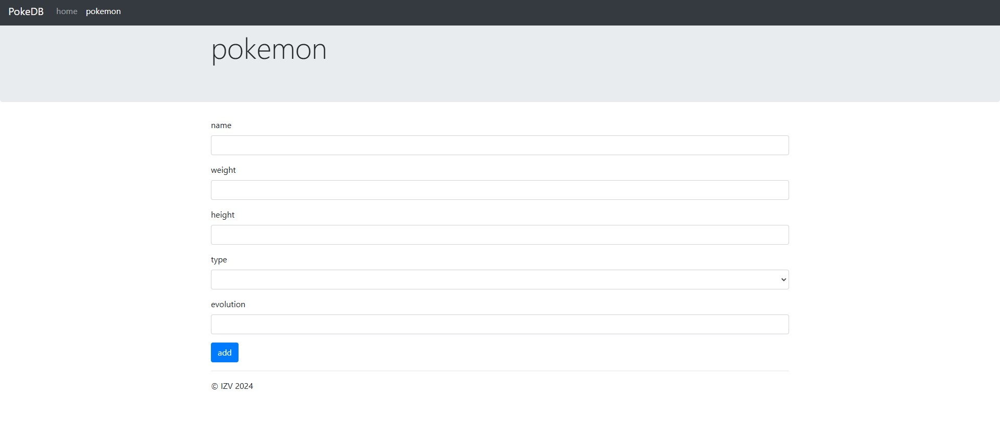

# Aplicación de Pokemon

Esta es una aplicación web desarrollada en PHP que permite a los usuarios crear, ver y listar pokemon.





## Instalación

Sigue estos pasos para descargar y configurar el repositorio:

1. Clona el repositorio:

    ```sh
    git clone https://github.com/aluqmor/pokemonApp.git
    ```

2. Navega al directorio del proyecto:

    ```sh
    cd tu-repositorio
    ```

3. Copia el archivo database.sql y crea la base de datos.

   
